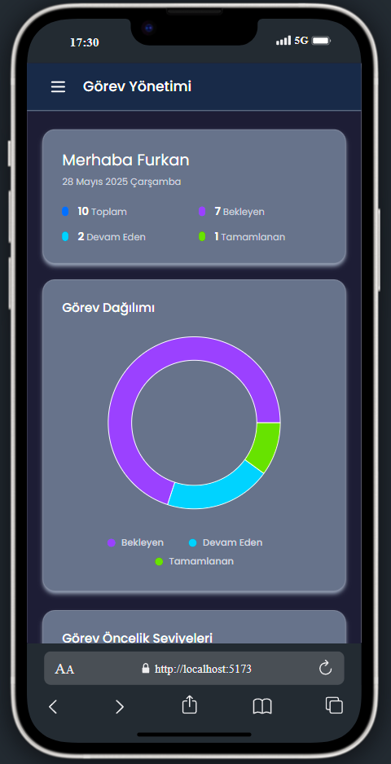
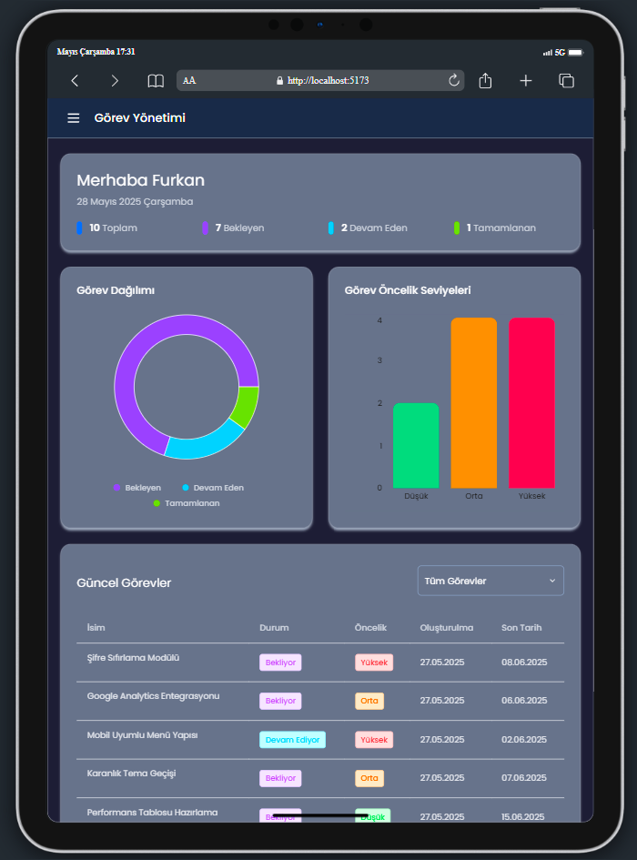
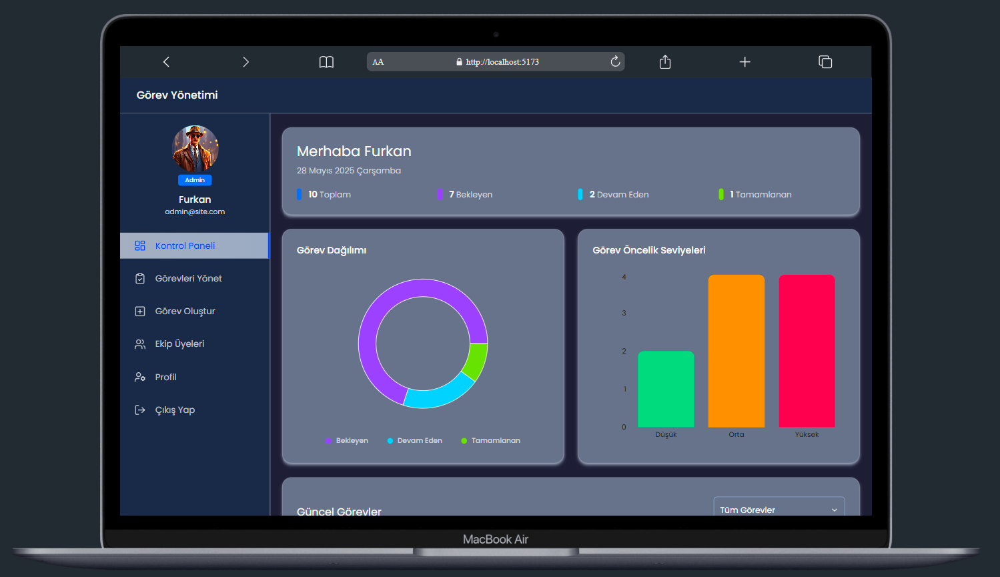

# Task Manager App

<div align="center">
  
</div>

## Proje Hakkında

Bu proje, kurum içi görev takibi, ekip yönetimi ve raporlama işlemlerinin kolayca yürütülebilmesini sağlayan modern bir yönetim panelidir.

### Admin Bilgileri

- Email: admin@site.com
- Password: test@123

### Kullanıcı Bilgileri

- Email: can@site.com
- Password: test@123

## İçindekiler

- [Özellikler](#özellikler)
- [Kullanılan Teknolojiler](#kullanılan-teknolojiler)
- [Kullanım](#kullanım)
- [Proje Dosya Yapısı](#proje-dosya-yapısı)
- [Ekran Görüntüleri](#ekran-görüntüleri)

## Canlı Demo

[Task Manager App](https://task-manager-app-nine-lemon.vercel.app/)

## Backend

- [Canlı](https://task-manager-api-virid.vercel.app/)
- [Kodlar](https://github.com/furkan-dogu/TaskManagerAPI)

## Özellikler

- Giriş yapabilen kullanıcı sistemi (admin/member ayrımı)
- Görev oluşturma, güncelleme, silme ve kullanıcıya atama
- Görevlerin duruma göre filtrelenmesi ve ilerleme takibi
- Görev önceliği ve teslim tarihi belirleme
- Dosya ekleme, yapılacak listesi (todoChecklist) yönetimi
- Ekip üyelerini yönetimi (profil güncelleme, şifre değiştirme, banlama/aktif etme)
- Excel olarak görev ve kullanıcı raporları indirme
- Kullanıcı dostu arayüz ve responsive tasarım
- Yükleme sırasında dinamik `Loading` bileşeni

## Kullanılan Teknolojiler

### React Ekosistemi

- **React 19** – Bileşen tabanlı frontend kütüphanesi
- **React DOM** – React bileşenlerinin tarayıcıya aktarılması
- **React Router DOM** – Sayfa yönlendirme yönetimi (SPA)
- **React Icons** – İkonlar için component tabanlı çözüm
- **React Hot Toast** – Uyarı ve bilgilendirme bildirimleri
- **Recharts** – Görev analizi grafik bileşenleri

### State Yönetimi

- **Redux Toolkit** – Modern Redux yapısı ile global state yönetimi
- **React Redux** – Redux store bağlantısı
- **Redux Persist** – Uygulama verilerinin kalıcı olarak saklanması

### HTTP ve API

- **Axios** – Backend API ile veri alışverişi için HTTP istemcisi

### Stil ve UI

- **Tailwind CSS** – Utility-first yaklaşımlı modern CSS framework, dark mode desteğiyle birlikte
- **@tailwindcss/vite** – Tailwind ile Vite entegrasyonu

## Kullanım

### Görev Oluşturma

- "Görev Oluştur" sayfasına gidin.  
- Başlık, açıklama, öncelik ve son teslim tarihi girin.  
- Görev atamak için kullanıcı(ları) seçin.  
- Yapılacaklar listesine en az bir madde ekleyin.  
- Gerekirse dosya ya da bağlantı ekleyin.  
- “GÖREV OLUŞTUR” butonuna tıklayın.

---

### Görev Güncelleme

- "Görevleri Yönet" sekmesinden ilgili görev kartına tıklayın.  
- Bilgileri güncelleyin.  
- “GÖREVİ GÜNCELLE” butonuna tıklayın.

---

### Görev Silme

- Görev detay sayfasında sağ üstteki “Sil” butonuna tıklayın.  
- Açılan uyarıyı onaylayarak görevi kalıcı olarak silin.

---

### Görev Durumu Filtreleme

- “Görevleri Yönet” sayfasında üst sekmelerden filtre seçin:  
  `All`, `Pending`, `In Progress`, `Completed`.

---

### Rapor İndirme

- “Görevleri Yönet” veya “Ekip Üyeleri” sayfasında “Raporu İndir” butonuna tıklayarak `.xlsx` formatında görev ya da kullanıcı raporlarını indirin.

---

### Ekip Üyelerini Görüntüleme

- “Ekip Üyeleri” sayfasında tüm kullanıcı kartlarını inceleyin.  
- Aktiflik durumlarını kontrol edin, kullanıcı detayına geçiş yapın.

## Proje Dosya Yapısı

```
Task Manager App
│
├── public 
│    └── favicon.ico           
├── src
│    ├── app             
│    │     └── store.jsx
│    ├── assets
│    │     ├── images 
│    │     │     └── [images]
│    │     └── screenshots 
│    │           └── [images]
│    ├── components
│    │     ├── Cards
│    │     │    ├── InfoCard.jsx  
│    │     │    ├── TaskCard.jsx  
│    │     │    └── UserCard.jsx  
│    │     ├── Charts
│    │     │    ├── CustomBarChart.jsx  
│    │     │    ├── CustomLegend.jsx  
│    │     │    ├── CustomPieChart.jsx  
│    │     │    └── CustomTooltip.jsx  
│    │     ├── Inputs
│    │     │    ├── AddAttachmentsInput.jsx  
│    │     │    ├── Input.jsx  
│    │     │    ├── ProfilePhotoSelector.jsx  
│    │     │    ├── SelectDropdown.jsx  
│    │     │    ├── SelectUsers.jsx  
│    │     │    └── TodoListInput.jsx  
│    │     ├── AvatarGroup.jsx    
│    │     ├── ChangePasswordForm.jsx    
│    │     ├── DeleteAlert.jsx    
│    │     ├── Loading.jsx    
│    │     ├── Modal.jsx    
│    │     ├── Navbar.jsx    
│    │     ├── Pagination.jsx    
│    │     ├── ProfileInfoForm.jsx    
│    │     ├── ProfileTabs.jsx    
│    │     ├── Progress.jsx    
│    │     ├── Sidebar.jsx    
│    │     ├── TaskListTable.jsx    
│    │     └── TaskStatusTabs.js    
│    ├── features
│    │     ├── authSlice.jsx 
│    │     ├── taskSlice.jsx  
│    │     └── userSlice.jsx  
│    ├── helpers
│    │     ├── addThousandsSeperator.js 
│    │     ├── data.js 
│    │     ├── filterOptions.js  
│    │     └── validateEmail.js  
│    ├── hooks
│    │     ├── useAuthCalls.jsx 
│    │     ├── useAxios.jsx 
│    │     ├── useTaskCalls.jsx  
│    │     └── useUserCalls.jsx  
│    ├── layouts
│    │     ├── AuthLayout.jsx  
│    │     └── DashboardLayout.jsx  
│    ├── pages
│    │     ├── Admin
│    │     │    ├── AdminDashboard.jsx  
│    │     │    ├── AdminProfile.jsx  
│    │     │    ├── CreateTask.jsx  
│    │     │    ├── ManageTask.jsx  
│    │     │    ├── MemberDetails.jsx  
│    │     │    └── TeamMembers.jsx  
│    │     ├── Auth
│    │     │    ├── Login.jsx  
│    │     │    └── SignUp.jsx  
│    │     ├── User
│    │     │    ├── MyTasks.jsx  
│    │     │    ├── TaskDetail.jsx  
│    │     │    ├── UserDashboard.jsx  
│    │     │    └── UserProfile.jsx 
│    │     └── NotFound.jsx
│    ├── router
│    │     ├── AppRouter.jsx  
│    │     └── PrivateRouter.jsx  
│    ├── App.jsx
│    ├── index.css
│    └── main.jsx
├── .gitignore
├── eslint.config.js
├── index.html
├── package-lock.json
├── package.json
├── README.md
└── vite.config.js
```

## Ekran Görüntüleri

<div align="center">
  
  
  
</div>

## Uyumluluk

Bu uygulama modern tüm tarayıcılarda ve mobil uyumlu olarak sorunsuz çalışır.  
Responsive yapı ve dark mode desteği Tailwind CSS ile sağlanmıştır.
